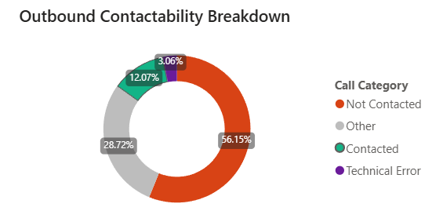
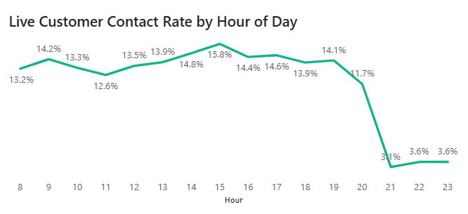
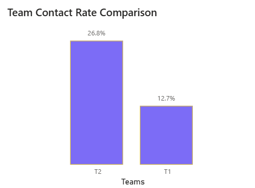

# 📊 Agent Performance & Dialing Efficiency (Outbound Contact Center)

## Executive Summary

This project analyzes outbound call center operations using operational call logs and conversion records from a financial services contact center. The dataset contains hundreds of thousands of dialing attempts and thousands of successful customer outcomes, enabling evaluation of both operational efficiency and business performance.

The objective of the analysis was to understand agent performance, customer contactability, and the operational factors influencing successful outcomes.

The analysis identified that the primary constraint in the operation is not agent productivity, but customer reachability. Only about **12% of outbound call attempts result in a live customer interaction**, meaning agents spend the majority of their effort attempting contact rather than speaking with customers.

Customer availability was also found to vary significantly by time of day. Midday dialing produces up to **4–5× higher contact probability** than late evening dialing, yet substantial call volume still occurs during low-probability hours. Additionally, one team reaches customers at more than **double the rate** of another, indicating unequal opportunity rather than purely unequal performance.

A structural data limitation was also discovered: conversion outcomes cannot be linked to individual calls because the datasets lack a shared interaction identifier. As a result, traditional performance metrics such as raw conversion rate may not reliably measure agent effectiveness.

The findings suggest the operation would benefit more from optimizing dialing timing, lead allocation, and measurement practices than from increasing dialing volume. By focusing on improving successful contact opportunities, the organization could increase productive conversations, improve fairness in performance evaluation, and reduce wasted dialing effort without increasing staffing levels.

## Data Understanding & Data Quality

### Data Sources

The analysis uses two operational datasets extracted from a contact center telephony platform and a conversion tracking system.

#### Call Logs (`calls`)
Each row represents a single outbound dialing attempt.  
The dataset includes timestamp, agent identifier, call routing outcome (wrap-up code), and system-recorded call duration.

#### Conversion Records (`conversions`)
This dataset records successful customer outcomes attributed to an agent, such as completed sales or account actions. It is used to measure business results following a successful customer interaction.

The call logs measure operational activity (attempted contact), while the conversion records measure business impact (successful outcomes).

---

### Call Outcome Standardization

The telephony system records dozens of granular wrap-up codes (e.g., *voicemail*, *no answer*, *system error*, *failed routing*, *number unreachable*). These raw statuses are inconsistent and not directly suitable for performance evaluation.

To enable reliable analysis, call outcomes were normalized into operational categories:

- **Contacted:** customer reached (e.g., customer contacted, resolved, transfer, answered)
- **Not Contacted:** attempted but no live interaction (e.g., voicemail, busy, no answer)
- **Technical Errors:** system or routing failures (e.g., failed dialing, throttled, unreachable numbers)
- **Other:** administrative or non-customer events

This standardization allows measurement of contactability and dialing efficiency independent of system-specific status labels.

---

### Data Reliability Investigation

Before analyzing agent performance, the reliability of key metrics was validated.

The system-provided call duration field (`duration_ms`) showed impossible values. Some agents recorded hundreds of calls with only a few minutes of total talk time, implying average conversations lasting less than one second. This indicates the duration field does not represent actual conversation time and likely reflects connection handling or incomplete event logging.

Because talk time could not be trusted, it was excluded from performance evaluation. Instead, performance was measured using verified behavioral outcomes (successful contact and conversion events).

---

### Assumptions & Limitations

Several analytical constraints were identified:

- Lead quality was not directly observable in the dataset.
- Conversion attribution depends on accurate logging in the source system.
- Call duration metrics were unreliable and therefore not used.

For this reason, agent comparisons are based on **contact-adjusted performance metrics** rather than activity-based measures such as raw call volume or talk time.

## Key Findings

### 1. Most Outbound Calls Never Reach a Customer

Across the full dataset, only **12% of outbound dialing attempts resulted in a confirmed customer interaction**.  
Approximately **84% of calls failed to produce a live conversation**, ending in voicemail, no answer, busy signal, or routing/system outcomes.

The largest single outcome category was automated or non-interactive responses (e.g., message played), followed by no-answer and voicemail events. In practical terms, agents spent the overwhelming majority of their working time attempting contact rather than speaking with customers.

This indicates that agents often perform substantial operational effort without a realistic opportunity to convert a customer. A sale requires a conversation, and in this operation conversations are rare relative to attempts.

**Interpretation:**  
The primary operational bottleneck is **reachability**, not agent productivity. Increasing dialing volume alone would not materially increase conversions because most additional calls would still fail to connect to a live person.

**SQL Reference:** `sql/02_contactability.sql`

---
### 2. Customer contact probability is strongly dependent on time of day

Customer contact probability varies significantly throughout the day.

During late morning and early afternoon (approximately **10:00 AM–3:00 PM**), the operation achieves its highest contact effectiveness, with contact rates around **13–16%** and more than **4,000 successful contacts per hour** at peak.

After **8:00 PM**, contact rates drop sharply to roughly **3–4%**, meaning agents are about **4–5× less likely** to reach a customer compared to midday dialing.

Despite the lower probability of success, a substantial number of calls are still placed during evening hours. Tens of thousands of call attempts occur in time periods where only a very small fraction result in actual conversations.

**Interpretation:**  
Agent outcomes are heavily influenced by dialing time. An agent working primarily evening shifts will naturally produce fewer successful contacts than an agent working midday, even if both have identical skill levels.

This indicates the operation is allocating labor and dialer capacity during periods with very low expected return.

**Reproducibility:** See `sql/03_hourly_contactability.sql` for the query used to calculate hourly contact rates.

---

### 3. Apparent Team Performance Differences Are Driven by Contact Opportunity

A clear difference exists between teams in the probability of reaching customers.

- **Team 2 contact rate:** ~26–27%
- **Team 1 contact rate:** ~12–13%

This means a Team 2 agent is **more than twice as likely** to speak to a customer during a call attempt.

Because conversions require successful contact, Team 2 agents receive substantially more opportunities to produce results. Even if agents in both teams had identical selling ability, Team 2 would still appear to outperform simply due to higher reachability.

**Interpretation:**  
Observed performance differences between teams are likely driven by operational conditions such as lead allocation, dialing windows, or campaign assignment rather than pure agent skill.

Comparing teams using raw conversion totals or conversion rates would therefore be misleading and could result in incorrect coaching or incentive decisions.

**Reproducibility:** See `sql/04_team_contact_rate.sql` for the query used to calculate team contact rates.

---

### 4. Agent Performance Cannot Be Reliably Measured With the Current Data Model

The analysis uses two operational datasets:

- Call logs recording dialing attempts and outcomes
- Conversion records recording successful business results attributed to agents

However, the datasets do not share a common identifier (call ID, lead ID, or customer ID).  
As a result, conversions cannot be linked to the specific call or interaction that generated them.

This prevents answering key performance questions, including:

- which calls produced conversions
- how many attempts were required per conversion
- whether differences in conversion results reflect agent ability or lead quality

**Interpretation:**  
Agent performance is not directly measured — it is inferred.  
The organization may be evaluating employees using metrics that the data structure cannot reliably support.

Without interaction-level linkage, conversion differences could be caused by contact opportunity, customer availability, or lead quality rather than sales effectiveness.

## Operational Recommendations

The analysis indicates that performance outcomes are driven primarily by contact opportunity rather than dialing effort. The operation can likely increase successful customer interactions without increasing staffing or call volume by adjusting dialing strategy and measurement practices.

### 1. Optimize Dialing Windows

Findings 1 and 2 show that customer reachability varies substantially by time of day. Midday hours produce approximately **4–5× higher contact probability** than late evening periods.

Currently, a large number of call attempts occur during low-contact hours, particularly after 8:00 PM, when contact rates fall to roughly **3–4%**.

**Recommended actions**
- Concentrate outbound dialing between **10:00 AM and 3:00 PM**
- Reduce or eliminate late-evening dialing blocks
- Align agent scheduling with high-contact windows
- Assign priority campaigns to peak contact hours

**Expected impact**
Shifting dialing effort toward high-contact periods would increase total successful conversations without increasing call volume, improving both agent productivity and customer experience.

---

### 2. Improve Lead Quality Management

Finding 1 shows that more than **90% of call attempts fail to reach a customer**.  
A portion of these failures are associated with unreachable numbers, routing outcomes, and repeated unsuccessful attempts.

This suggests dialing effort is frequently spent on low-probability contacts.

**Recommended actions**
- Validate and clean phone number lists before campaigns
- Limit repeated attempts on consistently unreachable contacts
- Implement retry rules based on contact probability instead of fixed attempt counts
- Prioritize leads with recent activity or verified contact information

**Expected impact**
Reducing low-quality dialing attempts would increase effective contact rates and reduce wasted dialing effort, allowing agents to spend more time in productive conversations.

---

### 3. Standardize Opportunity Across Teams

Finding 3 shows Team 2 reaches customers **more than twice as often** as Team 1 (≈26–27% vs ≈12–13% contact rate).  
This indicates unequal opportunity to succeed rather than purely unequal performance.

**Recommended actions**
- Review lead allocation rules between teams
- Standardize calling schedules across teams
- Distribute high-contact campaigns evenly
- Monitor contact rate as an operational fairness metric

**Expected impact**
More balanced opportunity would allow performance differences to better reflect agent skill, improving coaching accuracy and employee morale.

---

### 4. Redesign Performance Measurement

Finding 4 identified a structural limitation: conversion outcomes cannot be linked to specific calls because the datasets lack a shared interaction identifier.

As a result, current performance metrics may not reliably measure agent effectiveness.

**Recommended actions**
- Implement a unique call/session identifier for every dialing attempt
- Store a persistent lead or customer ID
- Link conversion events to originating interactions
- Track attempts per conversion and contacts per conversion

**Expected impact**
Interaction-level tracking would enable reliable agent evaluation, accurate coaching, and data-driven incentive structures. It would also allow measurement of lead quality and customer journey effectiveness.

---

### Overall Expected Benefit

The recommendations do not require increased staffing or dialing volume.  
Instead, they focus on reallocating effort toward higher-probability interactions and improving measurement accuracy.

Collectively, these changes would be expected to:

- Increase successful customer contacts
- Improve agent productivity
- Produce fairer performance evaluation
- Reduce operational waste
- Support better workforce management decisions

---
## Expected Impact

The analysis indicates that performance limitations are driven primarily by contact opportunity rather than agent effort.

Currently, only about **12% of outbound call attempts result in a live customer interaction**, and contact probability varies by as much as **4–5× depending on dialing time**. In addition, one team reaches customers at more than **double the rate** of the other, suggesting unequal opportunity rather than unequal capability.

By concentrating dialing activity in high-contact hours, improving lead quality, and standardizing opportunity across teams, the operation can increase successful customer interactions without increasing call volume or staffing.

Implementing interaction-level tracking would also allow management to distinguish operational issues (reachability) from agent effectiveness (conversion ability), enabling more accurate coaching, fairer performance evaluation, and better campaign management.

Overall, these changes would shift the operation from a volume-driven dialing process to a contact-driven engagement strategy, improving efficiency while reducing wasted dialing effort.

---
## Signed By
*Daris Daniel Abad*
